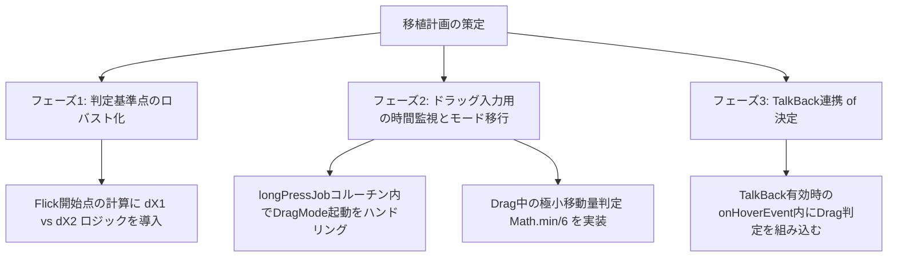

# DTalker IME 入力移植における技術的懸念点 調査レポート

本レポートは、`TenKey.kt` に DTalker IME （`KeyboardViewEx.java`）の**「フリック入力（Flick）」**および**「ドラッグ入力（Drag）」**のアルゴリズムと設計を移植するにあたり、技術的な懸念点と課題、および推奨されるアプローチについて詳細に調査した結果をまとめたものです。

---

## 1. 移植検討の結論（サマリー）

DTalker IME の入力方式は非常に堅牢で、特に TalkBack 利用者向けのドラッグ（探り打ち）入力は画期的ですが、現在の `TenKey.kt` の設計思想といくつかの根本的な部分で**競合（衝突）**が発生します。

最もクリティカルな課題は **「TalkBack有効時におけるドラッグ入力の動作可否」** と **「既存のコルーチン長押しタイマーとの重複」** です。これらを解消せずに単なるコードの翻訳移植を行うと、TalkBack でドラッグ入力が一切動かない、または通常の長押しポップアップと処理が衝突してフリック選択ができなくなるといったバグが発生します。

---

## 2. 詳細な懸念点と技術的課題

### 🔴 懸念点 1. TalkBack（アクセシビリティ）下での動作保証（最重要）

DTalker IME のドラッグ入力は、主に視覚障害者が「TalkBack の音声案内を聞きながら指をずらして文字を選択し、離して確定する」ことを目的としています。しかし、ここには Android OS のアクセシビリティ仕様に起因する重大な課題があります。

* **現状の `TenKey.kt` の TalkBack 処理**:
  TalkBack 有効時、タッチイベントは OS により `HoverEvent` に変換されます。`TenKey.kt` では、`onInterceptHoverEvent` および `onHoverEvent` が呼び出され、**通常の `onTouch`（`ACTION_DOWN/MOVE/UP`）は早期リターンされ実行されません。**
* **DTalker IME（`KeyboardViewEx.java`）の処理**:
  DTalker IME では、`onHoverEvent` で以下のように `ACTION_HOVER_ENTER/MOVE/EXIT` を `ACTION_DOWN/MOVE/UP` に書き換え、自前で `onTouchEventEx` (通常のタッチ処理) にイベントを流し込む（**Hover-to-Touch変換**）という非常にアグレッシブな処理を行っています。
  ```java
  // KeyboardViewEx.java
  case MotionEvent.ACTION_HOVER_MOVE:
      event.setAction(MotionEvent.ACTION_MOVE);
      break;
  ...
  return onTouchEventEx(event);
  ```
* **移植時の課題**:
  現在の `TenKey.kt` では、TalkBack 有効時は `onHoverEvent` 内で "Confirm on lift"（離した瞬間に現在ホバーしているキーを直接入力する）というシンプルな処理を行っています。
  もしドラッグ入力（500ms 滞留 ➔ 数ミリずらす）を TalkBack 下で動作させたい場合、**ホバーイベント中にドラッグによる方向選択ができるように `onHoverEvent` を大幅に書き換える**か、あるいは DTalker のような **「ホバーイベントをタッチイベントに強制変換して通常の `onTouch` 処理に流し込む」という複雑な仲介処理を実装する必要があります。**

---

### 🟡 懸念点 2. 既存の「コルーチン長押しタイマー」と「滞留時間タイマー」の重複・競合

* **DTalker IME のドラッグ起動処理**:
  `ACTION_MOVE` 内で `mCurrentKeyTime`（同じキー上での移動時間）を積算し、**500ms** を超えた時点でドラッグモード（`mDragSelectMeasure = true`）を起動します。
* **`TenKey.kt` の長押し処理**:
  `ACTION_DOWN` 時に `longPressJob = scope.launch` を起動し、`delay(ViewConfiguration.getLongPressTimeout().toLong())`（Android標準では通常 **400ms 〜 500ms**）が経過した時点で `onLongPressed()` を呼び出し、フリックプレビューポップアップを四方に表示する仕様になっています。
* **移植時の課題**:
  - ドラッグ入力の「滞留時間（500ms）」と通常の「長押し（500ms）」のタイミングがほぼ同一であるため、**ユーザーが長押しした際に「四方プレビューのポップアップ表示」と「ドラッグ入力の検知」が同時にトリガーされます。**
  - DTalker のドラッグ入力は、指をずらした際にポップアップの表示をリアルタイムに変更し、音声案内をする仕様です。`TenKey.kt` の既存の `onLongPressed()`（四方にポップアップを出す）との間で、ポップアップの表示制御や描画（`popupWindowActive` や `popupWindowTop/Left/Right/Bottom`）で表示の競合が発生します。

---

### 🟡 懸念点 3. ジェスチャー検出方式の競合（`GestureDetector` vs `onTouch`手動判定）

* **DTalker IME のフリック処理**:
  Android 標準の `GestureDetector`（特に `onFling`）を利用し、「指をはじく速度（`velocityX > mSwipeThreshold`）」をトリガーとして `swipeLeft/Right/Top/Bottom` を呼び出します。
* **`TenKey.kt` のフリック処理**:
  `GestureDetector` は使わず、`onTouch` 内の `ACTION_MOVE` で毎回 `getGestureType` を呼び出し、初期タッチ座標からの**移動距離**（`flickSensitivity`、デフォルト100px）を比較してリアルタイムにフリック方向（`GestureType`）を決定しています。
* **移植時の課題**:
  - もし DTalker の `GestureDetector` 方式をそのまま導入する場合、`TenKey.kt` が持つマルチタッチ処理（`ACTION_POINTER_DOWN` や第2指でのフリック確定 `setFlickActionPointerDown`）と競合し、ジェスチャーの誤検知が発生しやすくなります。
  - **推奨解決案**: フリック入力に関しては、DTalkerの「速度判定」を無理に移植するのではなく、現在の `TenKey.kt` の `getGestureType` による距離ベースのジェスチャー判定をベースとし、DTalkerの**「キーの端を触った時でもブレない基準点計算ロジック（dX1 vs dX2）」**のみを移植する方がはるかに安全でバグが起きにくいです。

---

## 3. データ構造と判定ロジックの乖離（Java vs Kotlin）

* **DTalker IME**:
  キー配列を `mKeys[keyIndex]` という物理的なインデックスで管理し、`key.codes` 配列のインデックス（`codes[1]`=左, `codes[2]`=上, `codes[3]`=右, `codes[4]`=下）から直接送出する文字を取得しています。
* **`TenKey.kt`**:
  `ConstraintLayout` の中に `AppCompatButton` をレイアウトした近代的な View 構造です。フリックで送る文字は、キーコードから直接ではなく、`keyMap` を通じて `currentInputMode.value.next(keyMap, key, isTablet)` から `KeyInfo` オブジェクトを取得し、その中の `flickLeft/Right/Top/Bottom` に格納されている文字を `flickListener?.onFlick` を通じて IME サービスに送信する洗練されたコアルール設計になっています。
* **移植時の課題**:
  DTalker IME の `mTapCount`（1=左, 2=上, 3=右, 4=下）というインデックスベース of 処理をそのままコピペすると、`TenKey.kt` の `InputMode` や `KeyMap` の状態管理と矛盾し、文字入力が機能しなくなります。
  ドラッグ入力が確定した際は、`TenKey.kt` の既存の `flickListener?.onFlick(gestureType, key, char)` にマッピングして文字を送信する必要があります。

---

## 4. 移植に向けた推奨ロードマップ

これらの懸念点を踏まえ、安全かつ効果的に移植するための推奨アプローチを提案します。



### アプローチ 1. [フリック入力の改善] 「基準点」計算の高度化
フリックの始点として、従来の「タッチ開始点」だけでなく、DTalker 同様に「キーの中心点」も計算に入れ、ブレを許容するロジックを `TenKey.kt` の `getGestureType` に導入します。
```kotlin
// 移植イメージ
val dX1 = finalX - pressedKey.initialX // タッチ開始点から
val dX2 = finalX - keyCenterX           // キーの中心点から
val deltaX = if (abs(dX1) > abs(dX2)) dX1 else dX2
```

### アプローチ 2. [ドラッグ入力の統合] コルーチン `longPressJob` との統合
既存の `longPressJob` を利用し、長押し（約500ms）が検知された時点で **「ドラッグ選択モード」** に移行させます。
- 長押しが検知された瞬間 (`onLongPressed`) に、その時点の指の座標を `mDragKeyX`, `mDragKeyY` として固定します。
- `ACTION_MOVE` で `mDragSelectMeasure` が有効な場合、`Math.min(key.width/6, key.height/6)` の極小移動量を監視し、滑らせた方向の文字プレビューを表示し、TalkBack 音声をリアルタイムで発声します。
- 指を離した `ACTION_UP` 時、ドラッグによる選択が行われていた場合は、その方向の `GestureType` に応じた文字（例: `keyInfo.flickLeft`）を確定送信します。

### アプローチ 3. [TalkBack対策] Hoverイベント内でのドラッグ動作の模倣
もし TalkBack でドラッグ入力を有効にしたい場合、DTalker のような「Hover-to-Touch変換」は `TenKey.kt` の既存の `onHoverEvent` と衝突するため避けるべきです。
代わりに、**`onHoverEvent` の `ACTION_HOVER_MOVE` において、同じキーの上で指が滞留した時間を `Handler`等で計測し、ホバー座標の微小変化からドラッグ方向を判定する「ホバー専用ドラッグ判定」**を `onHoverEvent` 内に個別に実装する方が、安全かつバグの少ない実装になります。

---

> [!IMPORTANT]
> **移植を開始する前に決めるべき仕様意思決定**
> 1. **ドラッグ入力は TalkBack 有効時のみ動作させたいですか？** それともTalkBack無効時（一般ユーザー向け）の長押しドラッグ操作としても提供したいですか？
> 2. **フリック感度（閾値）** は、既存の `flickSensitivity`（距離のみ）を維持しますか、それともDTalkerのような速度ベース（`GestureDetector`）への全面移行を望みますか？
